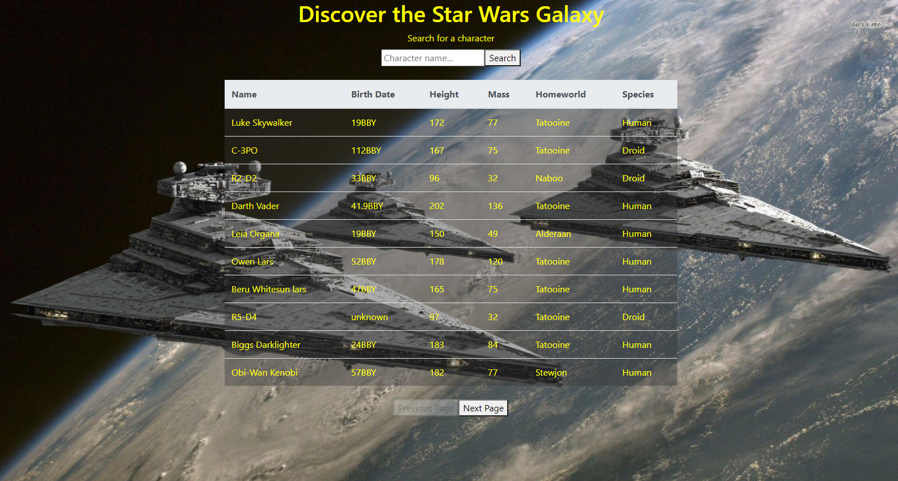

# Star Wars App

*A fun app that allows you to exploer the Star Wars Galaxy, written in JavaScript, HTML, React, and Bootstrap*

Use it [here](https://discover-star-wars.herokuapp.com/)

## Summary
A fun app that allows you to view all the characters from the Star Wars Galaxy.

The app pulls data from a public Star Wars API and displays the characters name, date of birth, height, mass, homeworld, and species.

This was my first project utilizing an API and asyncronys functions. It was a fun and challenging project. Understanding how anysc and await work together will be very beneficial in future projects.

## Author
- **Graham Smith** - Full-Stack Software Developer